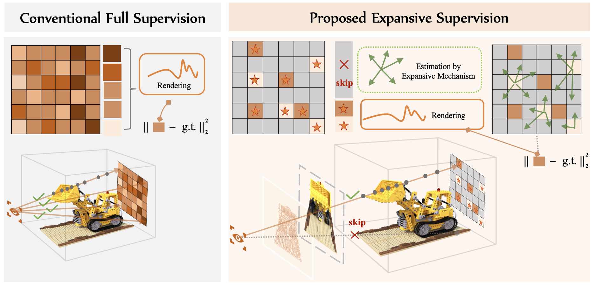

# [ICME'2025] Expansive Supervision for Neural Radiance Fields
Official Implementation for ICME'2025 "Expansive Supervision for Neural Radiance Fields".
### [Paper](https://arxiv.org/pdf/2409.08056) | [Code](https://github.com/zwx-open/Expansive-Supervision) 

[Weixiang Zhang](https://weixiang-zhang.github.io/),
Wei Yao,
[Shuzhao Xie](https://shuzhaoxie.github.io/),
Shijia Ge,
[Chen Tang](https://www.chentang.cc/),
[Zhi Wang*](http://pages.mmlab.top/)<br>
Tsinghua University \
\*: Corresponding Author

This is the official PyTorch implementation of "Expansive Supervision for Neural Radiance Fields" (accepted by *ICME 2025*).

# Overview
<p align="center">
  
</p>

**Abstract.** Neural Radiance Field (NeRF) has achieved remarkable success in creating immersive media representations through its exceptional reconstruction capabilities. However, the computational demands of dense forward passes and volume rendering during training continue to challenge its real-world applications. In this paper, we introduce Expansive Supervision to reduce time and memory costs during NeRF training from the
perspective of partial ray selection for supervision. Specifically, we observe that training errors exhibit a long-tail distribution
correlated with image content. Based on this observation, our
method selectively renders a small but crucial subset of pixels
and expands their values to estimate errors across the entire
area for each iteration. Compared to conventional supervision,
our approach effectively bypasses redundant rendering processes,
resulting in substantial reductions in both time and memory
consumption. Experimental results demonstrate that integrating
Expansive Supervision within existing state-of-the-art acceleration frameworks achieves 52% memory savings and 16% time
savings while maintaining comparable visual quality

# Quick Start
## Clone Repository
```shell
git clone https://github.com/zwx-open/Expansive-Supervision
cd Expansive-Supervision
```
## Dataset 
Download Corresponeding Dataset under the folder of `./data/`:
* [Synthetic-NeRF](https://drive.google.com/drive/folders/128yBriW1IG_3NJ5Rp7APSTZsJqdJdfc1) 
* [Synthetic-NSVF](https://dl.fbaipublicfiles.com/nsvf/dataset/Synthetic_NSVF.zip)
* [Tanks&Temples](https://dl.fbaipublicfiles.com/nsvf/dataset/TanksAndTemple.zip)
* [Forward-facing](https://drive.google.com/drive/folders/128yBriW1IG_3NJ5Rp7APSTZsJqdJdfc1)

More detials can be found in [TensoRF](http://github.com/apchenstu/TensoRF).

## Enviroment Setup
Tested Enviroments:
- Ubuntu 20.04 with PyTorch 1.12.1 & CUDA 11.3.1 on RTX 3090

## Run the Code
We have prepared configuration for runnning baselines with `lego` scenes in `nerf-syn` dataset.
Just uncomment corresponding functions in `run.py`:
```py
if __name__ == "__main__":
    run_standard_nerf(use_cuda=0)
    # run_egra_nerf(use_cuda=1)
    # run_soft_nerf(use_cuda=2)
    # run_expansive_nerf(use_cuda=3)
```

If you want to run all scenes in one shot, please use `--multi_data` in args.

For more coinfiguration, please refer to `./opt.py` and `./components/tesorf/tensorf_opt.py`.


# Additional Related Research
Welcome to explore our related research. The source code for all works has been available.
- (*CVPR'2025*) EVOS: Efficient Implicit Neural Training via EVOlutionary Selector| 
[[paper]](https://arxiv.org/pdf/2412.10153) | 
[[project]](https://weixiang-zhang.github.io/proj-evos/) | 
[[code]](https://github.com/zwx-open/EVOS-INR) | 
- (*AAAI'2025*) Enhancing Implicit Neural Representations via Symmetric Power Transformation | 
[[paper]](https://arxiv.org/abs/2412.09213) | 
[[project]](https://weixiang-zhang.github.io/proj-symtrans/) | 
[[code]](https://github.com/zwx-open/Symmetric-Power-Transformation-INR) | 
- Recent Progress of Implicit Neural Representations | 
[[code]](https://github.com/zwx-open/Recent-Progress-of-INR)

# Acknowledgments
We thank the authors of the following works for releasing their codebases:
- [TensoRF](https://github.com/apchenstu/TensoRF)
- [Soft Mining](https://github.com/ubc-vision/nf-soft-mining)

# Citation
Please consider leaving a ⭐ and citing our paper if you find this project helpful:

```
@article{expansive-sup-nerf,
  title={Expansive supervision for neural radiance field},
  author={Zhang, Weixiang and Xie, Shuzhao and Ge, Shijia and Yao, Wei and Tang, Chen and Wang, Zhi},
  journal={arXiv preprint arXiv:2409.08056},
  year={2024}
}
```